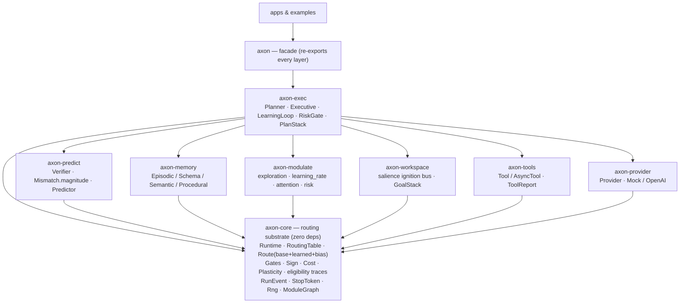
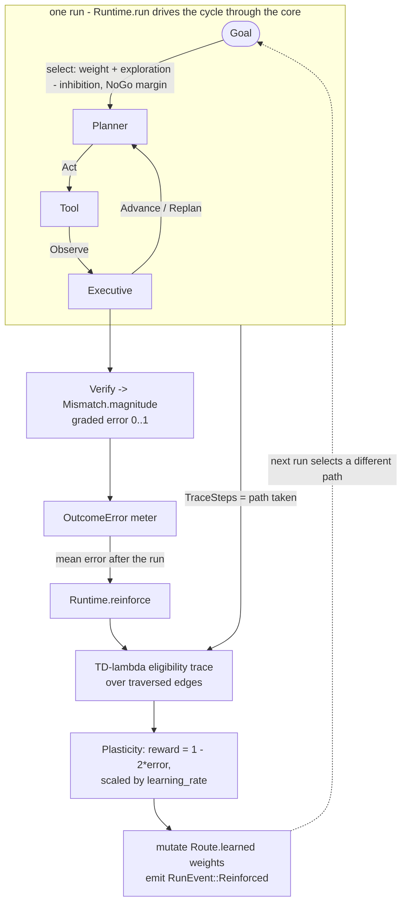

# Axon

Axon is a brain-inspired Rust SDK for agentic systems. The core owns only the
**transmission substrate** — it routes typed signals between modules over gated,
weighted edges — and every cognitive faculty (prediction, memory,
neuromodulation, planning, tools, model calls) is a typed module that *plugs onto*
that substrate. Crucially, the substrate **learns**: outcomes feed back through
credit assignment to reshape which routes win, so the agent improves with
experience instead of re-deriving every decision from static priors.

The architectural rule that makes this work: **everything depends on
`axon-core`; `axon-core` depends on nothing.** The router has no idea what an LLM,
a memory, or a prediction is — which is what keeps it deterministic and testable.

## The workspace

| Crate | Brain analog | Owns |
|---|---|---|
| `axon-core` | axons · thalamus · basal ganglia | typed signals, weighted/gated routes, runtime, **plasticity & credit assignment**, breakers, stop/cancel, seeded RNG, topology |
| `axon-tools` | sensorimotor cortex | filesystem/shell/git tools, sync **and async** tool modules, structured `ToolReport` outcomes |
| `axon-memory` | hippocampus | recall by similarity/importance/recency, bounded forgetting, schema/semantic/procedural stores |
| `axon-predict` | cerebellum | predictions, **graded** mismatch error, verifier, learned forward model |
| `axon-modulate` | neuromodulators | mode + load-bearing `exploration` / `learning_rate` / `attention` / `risk` knobs |
| `axon-workspace` | global workspace | salience-gated ignition bus, prioritized goal stack |
| `axon-exec` | prefrontal cortex | routed plan→act→observe loop, learning loop, risk gate, re-planning, provider-backed planning |
| `axon-provider` | language areas | the async, vendor-agnostic seam model calls live behind |

The root `axon` crate is a facade: it re-exports `axon-core` at the top level and
exposes the other crates as modules (`axon::memory`, `axon::exec`, …).



## The learning loop

The headline capability: the plan→act→observe cycle runs *through* the routing
core, and each run's graded outcome error is fed back to reshape the routes that
produced it.



1. A run flows through the core, which records the `TraceSteps` — the exact edges
   traversed.
2. The `Executive` verifies each observation; `Mismatch::magnitude()` yields a
   **graded** error in `[0,1]` (how wrong, not just *that* it was wrong).
3. After the run, `LearningLoop::run_and_learn` reinforces the trajectory: a
   **TD(λ) eligibility trace** assigns graded credit back over the traversed
   edges, and a `Plasticity` policy turns error into a weight change scaled by
   `learning_rate`.
4. Because `effective weight = base + learned + bias`, the next run's selection
   changes — the agent has learned, with no rewiring.

`cargo run --example learning_loop` shows this end to end: an agent with a flaky
tool and a good tool routes to the flaky one first, gets a maximal error, and by
the next episode has demoted that path below the good tool — and stays there.

## What the core gives you

- **A routed agent loop** — the plan→act→observe cycle as `Module`s wired by
  content-addressed gates (`axon::exec::wire_loop`), so the cognitive layers run
  *through* the core, not beside it.
- **Closed learning** — mutable, decaying route weights; a `Plasticity` trait;
  TD(λ) credit assignment over traversed edges; observable via
  `RunEvent::Reinforced` and persistable via `serde`.
- **Load-bearing neuromodulation** — `exploration` is a softmax selection
  temperature, `learning_rate` scales plasticity, `attention` sets memory
  importance, `risk` gates dangerous actions — all from one `Modulators` struct,
  with a seeded `Rng` so stochastic runs stay reproducible.
- **Selection discipline** — weighted argmax with a NoGo margin (decline when no
  option clearly wins), signed/inhibitory edges, opt-in fan-out (`select_all`),
  and per-mode routing profiles.
- **Safety & robustness** — `StopToken` cancellation (cooperative in the sync
  runtime, mid-future in async), per-run cost budgets, a stall guard against
  oscillation, and half-open circuit breakers that degrade to fallback routes.
- **Deeper cognition** — similarity/importance/recency recall with bounded
  forgetting and semantic/procedural stores; a salience-gated workspace ignition
  bus; a learned forward model; a working-memory scratchpad; a perseveration
  guard plus plan-swap re-planning; a prioritized goal stack.
- **An async runtime** — runtime-agnostic `AsyncRuntime` / `AsyncModule` /
  `AsyncTool` for modules that do real I/O. The library depends on no executor.
- **Event streaming & topology** — `Runtime::run_observed` streams a `RunEvent`
  per transition; `ModuleGraph` exposes degree, hubs, reachability, and branching.
- **A real provider** — enable the `openai` feature for an OpenAI Chat
  Completions `Provider`; the default seam ships only the trait and a
  deterministic `MockProvider`, so it stays dependency-free and offline-testable.
- **Optional persistence** — enable the `serde` feature to snapshot and restore
  memory, workspace, neuromodulator state, and learned routing weights.

## Quick start

The bare substrate: register a module, add a gated route, drive a signal.

```rust
use axon::{Allow, FnModule, InputId, ModuleId, ModuleOutput, Runtime, Signal, Weight};

#[derive(Debug)]
enum Payload {
    Goal,
    Observation,
}

# fn main() -> Result<(), Box<dyn std::error::Error>> {
let input = InputId::new("input")?;
let worker = ModuleId::new("worker")?;
let mut runtime = Runtime::default();

runtime.insert_module(FnModule::new(worker.clone(), |_signal: Signal<Payload>| {
    Ok(ModuleOutput::stop(Payload::Observation))
}))?;
runtime.add_input_route(input.clone(), worker, Weight::new(10), Allow)?;

let report = runtime.run(input, Signal::new(Payload::Goal))?;
assert_eq!(report.steps().len(), 1);
# Ok(())
# }
```

## Examples

```bash
cargo run --example basic_loop       # the bare routing core
cargo run --example neuro_stack      # layers composed directly in an Executor
cargo run --example integrated_loop  # the same layers driven through the core
cargo run --example llm_planner      # a provider-proposed plan, run with event streaming
cargo run --example learning_loop    # the closed learning loop: the agent learns to avoid a flaky tool
```

## Example application

`apps/repo-scout` depends on the `axon` SDK the way a downstream consumer would:
a provider proposes a plan, `propose_plan` types it, and the routed core executes
it with real `FsList` / `FsRead` tools while streaming events.

```bash
cargo run -p repo-scout -- "survey this repository"            # offline, mock provider
OPENAI_API_KEY=... cargo run -p repo-scout --features openai   # real OpenAI planning
```

## Research

The neuroscience behind the naming and boundaries lives in `docs/research/`. The
design corpus was distilled into a ranked roadmap in
`docs/research/notes/09_implementation_gap_analysis.md`; every gap in it is now
implemented and tested.
